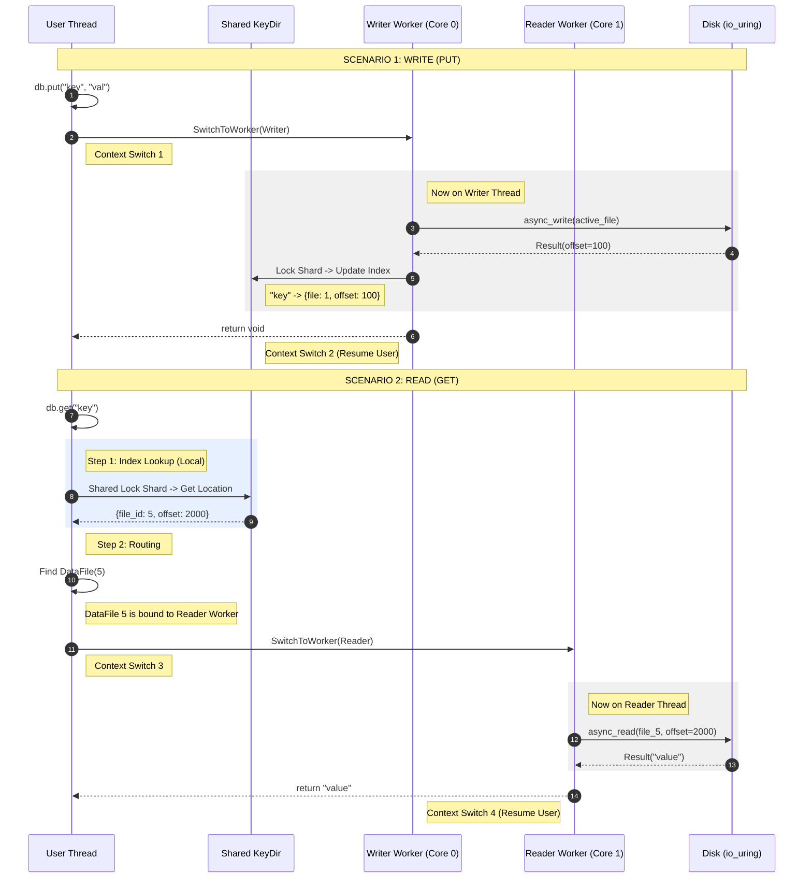
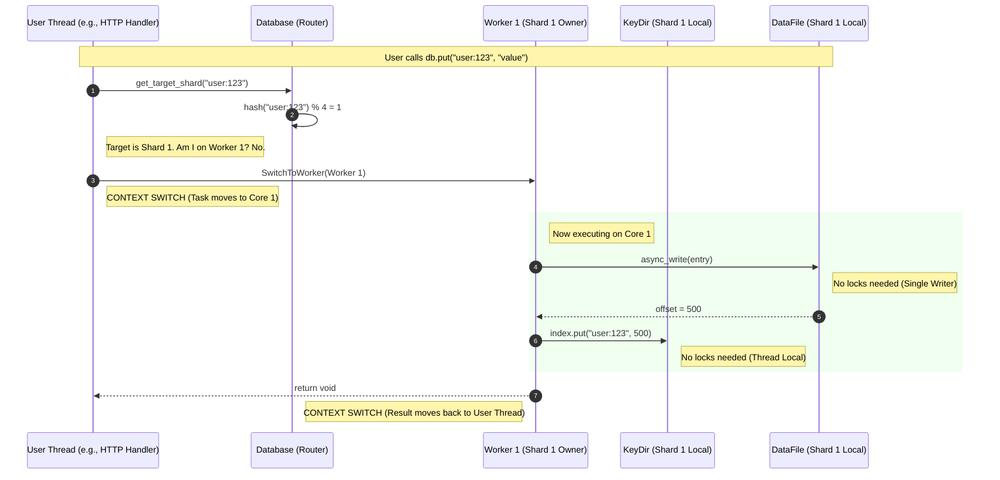

```text
bitcask/
├── include/
│   └── bitcask/
│       ├── bitcask.h              # Main public API
│       ├── entry.h                # Entry format (CRC, timestamp, key, value)
│       ├── datafile.h             # Data file management
│       ├── hint_file.h            # Hint file for faster startup
│       ├── keydir.h               # In-memory hash index
│       ├── compaction.h           # Merge/compaction logic
│       ├── config.h               # Configuration options
│       └── errors.h               # Error types
├── src/
│   ├── bitcask.cpp
│   ├── entry.cpp
│   ├── datafile.cpp
│   ├── hint_file.cpp
│   ├── keydir.cpp
│   └── compaction.cpp
├── tests/
│   ├── bitcask_test.cpp
│   ├── entry_test.cpp
│   ├── compaction_test.cpp
│   └── benchmark.cpp
└── examples/
    └── basic_usage.cpp
```

Main design 1.



The Step-by-Step Analysis

Yes, SwitchToWorker is absolutely involved, and it is the primary mechanism for thread safety in this design.

1. The Write Path (put)

The active_file (the mutable file we are appending to) is owned by the Writer Worker. To write to it safely without
mutexes on the file descriptor, we must be on that thread.

Main Thread: Calls db.put(key, value).

Main Thread: Checks active_file_->worker(). It sees it is the Writer Worker.

Transition: Calls co_await SwitchToWorker(writer_worker). The Main Thread coroutine suspends.

Writer Worker: Resumes the coroutine.

Writer Worker: Calls active_file_->async_write(). This submits an SQE to the Writer's io_uring.

Writer Worker: Updates KeyDir. Since KeyDir is shared, it takes a shard-granular lock.

Optimistic: This is fast.

Pessimistic: If a reader holds this shard's lock, the Writer Worker stalls here.

Writer Worker: co_return.

Transition: Control returns to the Main Thread (or stays on Writer depending on your Task implementation).

2. The Read Path (get)

This is where the "Granular Locking" shines. We want to avoid sending the request to a worker if we don't know which
file contains the data yet.

Main Thread: Calls db.get(key).

Main Thread (Local lookup): It queries KeyDir immediately.

It takes a shared_lock on the specific shard for key.

It retrieves {file_id, offset, size}.

Benefit: We haven't context-switched yet! If the key doesn't exist, we return NotFound instantly. Cost is near zero.

Main Thread (Routing): It looks up file_id in the older_files_ map to find the DataFile object.

Let's say DataFile 100 was assigned to Reader Worker 1 when it was opened/rotated.

Transition: The DataFile's async_read method internally calls co_await SwitchToWorker(this->worker_).

Reader Worker 1: Resumes execution.

Reader Worker 1: Submits pread to its io_uring.

Reader Worker 1: Returns data.

Summary of "SwitchToWorker" Logic

Write: Always switches to the single Writer Worker.

Read (Index): Never switches. Runs on the calling thread (using locks).

Read (IO): Always switches to the specific Worker that owns that file.

Why this is good (The "Happy Path")

This design minimizes "blind" context switches. You only switch threads when you know you need to perform I/O on a
specific ring. You don't switch threads just to look up a hash map.

Main design 2:

