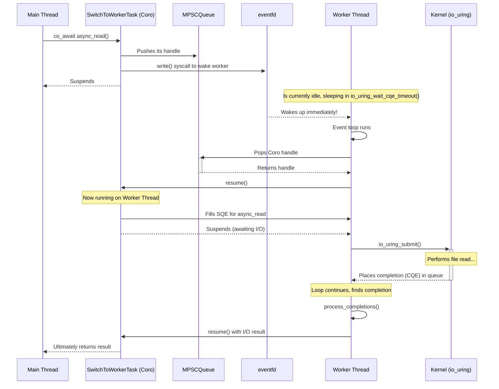
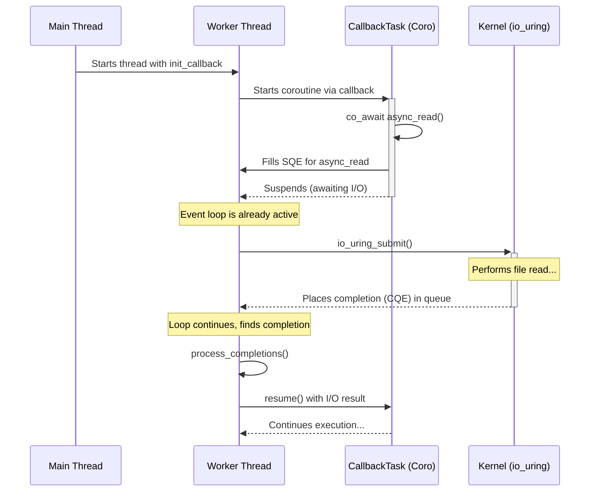

# IO Traces

To understand the io workflow in both switch to worker and worker callback.

## Switch to Worker

```mermaid
sequenceDiagram
    participant Main Thread
    participant SwitchToWorkerTask (Coro)
    participant MPSCQueue
    participant eventfd
    participant Worker Thread
    participant Kernel (io_uring)

    Main Thread->>SwitchToWorkerTask (Coro): co_await async_read()
    SwitchToWorkerTask (Coro)->>+MPSCQueue: Pushes its handle
    SwitchToWorkerTask (Coro)->>+eventfd: write() syscall to wake worker
    SwitchToWorkerTask (Coro)-->>Main Thread: Suspends

    Note over Worker Thread: Is currently idle, sleeping in io_uring_wait_cqe_timeout()

    eventfd-->>Worker Thread: Wakes up immediately!

    Worker Thread->>Worker Thread: Event loop runs
    Worker Thread->>+MPSCQueue: Pops Coro handle
    MPSCQueue-->>-Worker Thread: Returns handle

    Worker Thread->>SwitchToWorkerTask (Coro): resume()
    Note over SwitchToWorkerTask (Coro): Now running on Worker Thread
    SwitchToWorkerTask (Coro)->>Worker Thread: Fills SQE for async_read
    SwitchToWorkerTask (Coro)-->>Worker Thread: Suspends (awaiting I/O)

    Worker Thread->>+Kernel (io_uring): io_uring_submit()
    Note over Kernel (io_uring): Performs file read...
    Kernel (io_uring)-->>-Worker Thread: Places completion (CQE) in queue

    Note over Worker Thread: Loop continues, finds completion
    Worker Thread->>Worker Thread: process_completions()
    Worker Thread->>SwitchToWorkerTask (Coro): resume() with I/O result
    SwitchToWorkerTask (Coro)-->>Main Thread: Ultimately returns result

```

## Worker Callback

```mermaid
sequenceDiagram
    participant Main Thread
    participant Worker Thread
    participant CallbackTask (Coro)
    participant Kernel (io_uring)

    Main Thread->>Worker Thread: Starts thread with init_callback

    Worker Thread->>+CallbackTask (Coro): Starts coroutine via callback
    CallbackTask (Coro)->>CallbackTask (Coro): co_await async_read()

    CallbackTask (Coro)->>Worker Thread: Fills SQE for async_read
    CallbackTask (Coro)-->>-Worker Thread: Suspends (awaiting I/O)

    Note over Worker Thread: Event loop is already active
    Worker Thread->>+Kernel (io_uring): io_uring_submit()
    Note over Kernel (io_uring): Performs file read...
    Kernel (io_uring)-->>-Worker Thread: Places completion (CQE) in queue

    Note over Worker Thread: Loop continues, finds completion
    Worker Thread->>Worker Thread: process_completions()
    Worker Thread->>CallbackTask (Coro): resume() with I/O result

    CallbackTask (Coro)-->>Worker Thread: Continues execution...

```